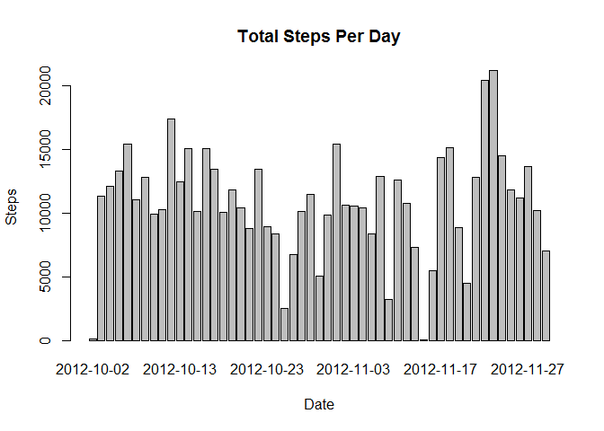

# Reproducible Research: Peer Assessment 1
Charmaine Ang  
14 Dec 2014  


## Loading and preprocessing the data

1.Load the data (i.e. read.csv())


```r
activity <- read.csv("activity.csv")
```

2.Process/transform the data (if necessary) into a format suitable for your analysis  
NIL 

## What is mean total number of steps taken per day?

For this part of the assignment, you can ignore the missing values in the dataset.

1.Make a histogram of the total number of steps taken each day


```r
# The total number of steps taken each day.
totStepsPerDay = aggregate(steps ~ date, data=activity, FUN=sum, na.action = na.omit)

# Plot
barplot(totStepsPerDay$steps, 
        names.arg=totStepsPerDay$date, 
        main="Total Steps Per Day", xlab="Date", ylab="Steps")
```

 

```r
# Output plot
dev.copy(png, file="./figure/Fig1-TotalStepPerDay.png")
```

```
## png 
##   3
```

```r
dev.off()
```

```
## pdf 
##   2
```

2.Calculate and report the mean and median total number of steps taken per day


```r
# The mean total number of steps per day
avgStepsPerDay <- mean(totStepsPerDay$steps); print(avgStepsPerDay)
```

```
## [1] 10766.19
```

```r
# The median total number of steps per day
medStepsPerDay <- median(totStepsPerDay$steps); print(medStepsPerDay)
```

```
## [1] 10765
```


## What is the average daily activity pattern?

1.Make a time series plot (i.e. type = "l") of the 5-minute interval (x-axis) and the average number of steps taken, averaged across all days (y-axis)


```r
# The average number of steps per 5-minute interval across all days 
avgStepsPer5m <- aggregate(steps ~ interval, data=activity, FUN=mean)

# Plot
plot(avgStepsPer5m, type="l", main="Average Number of Steps Per 5-min Interval across All Days", 
     xlab="5-min Intervals", ylab="Steps")
```

 

```r
# Output plot
dev.copy(png, file="./figure/Fig2-AvgSteps5minInterval.png")
```

```
## png 
##   3
```

```r
dev.off()
```

```
## pdf 
##   2
```

2.Which 5-minute interval, on average across all the days in the dataset, contains the maximum number of steps?


```r
# The 5-min interval that contains the maximum number of steps
maxStepsInterval <- avgStepsPer5m$interval[which.max(avgStepsPer5m$steps)]
print(maxStepsInterval)
```

```
## [1] 835
```


## Imputing missing values

Note that there are a number of days/intervals where there are missing values (coded as NA). The presence of missing days may introduce bias into some calculations or summaries of the data.

1.Calculate and report the total number of missing values in the dataset (i.e. the total number of rows with NAs)


```r
# Data exploration shows missing values in the column called 'steps'.
stepsNA <- is.na(activity$steps)

# Count the number of missing values.
stepsNACount <- sum(stepsNA); print(stepsNACount)
```

```
## [1] 2304
```

2.Devise a strategy for filling in all of the missing values in the dataset. The strategy does not need to be sophisticated. For example, you could use the mean/median for that day, or the mean for that 5-minute interval, etc.

**Strategy: The mean of the 5-minute interval is used to fill the missing values.**


```r
# Samples of the mean of each 5-minute interval in a day:
head(avgStepsPer5m)
```

```
##   interval     steps
## 1        0 1.7169811
## 2        5 0.3396226
## 3       10 0.1320755
## 4       15 0.1509434
## 5       20 0.0754717
## 6       25 2.0943396
```

3.Create a new dataset that is equal to the original dataset but with the missing data filled in.


```r
actFull <- merge(activity, avgStepsPer5m, by.x="interval", by.y="interval",suffixes="Origin")

# Samples of the new activity data set BEFORE imputing:
head(actFull)
```

```
##   interval stepsOrigin       date  stepsNA
## 1        0          NA 2012-10-01 1.716981
## 2        0           0 2012-11-23 1.716981
## 3        0           0 2012-10-28 1.716981
## 4        0           0 2012-11-06 1.716981
## 5        0           0 2012-11-24 1.716981
## 6        0           0 2012-11-15 1.716981
```

```r
# Fill the missing data using the strategy defined at step 2.
PositionNA <- is.na(actFull$stepsOrigin)
actFull$stepsOrigin[PositionNA] <- actFull$stepsNA[PositionNA]

# Samples of the new activity data set AFTER imputing:
head(actFull)
```

```
##   interval stepsOrigin       date  stepsNA
## 1        0    1.716981 2012-10-01 1.716981
## 2        0    0.000000 2012-11-23 1.716981
## 3        0    0.000000 2012-10-28 1.716981
## 4        0    0.000000 2012-11-06 1.716981
## 5        0    0.000000 2012-11-24 1.716981
## 6        0    0.000000 2012-11-15 1.716981
```

4.Make a histogram of the total number of steps taken each day and Calculate and report the mean and median total number of steps taken per day. Do these values differ from the estimates from the first part of the assignment? What is the impact of imputing missing data on the estimates of the total daily number of steps?

**Total Steps Per Day (Full Data)**

```r
# The total number of steps taken each day where missing data is filled.
totStepsPerDay_Full = aggregate(stepsOrigin ~ date, data=actFull, FUN=sum)

# Plot
barplot(totStepsPerDay_Full$steps, 
        names.arg=totStepsPerDay_Full$date, 
        main="Total Steps Per Day (Full Data)", xlab="Date", ylab="Steps")
```

 

```r
# Output plot
dev.copy(png, file="./figure/Fig3-TotalStepPerDay(Full).png")
```

```
## png 
##   3
```

```r
dev.off()
```

```
## pdf 
##   2
```

**Mean and median of total steps per day (with full data)**

```r
# The mean total number of steps per day
avgStepsPerDay_Full <- mean(totStepsPerDay_Full$steps); print(avgStepsPerDay_Full)
```

```
## [1] 10766.19
```

```r
# The median total number of steps per day
medStepsPerDay_Full <- median(totStepsPerDay_Full$steps); print(medStepsPerDay_Full)
```

```
## [1] 10766.19
```

**Comparison of mean and median (with and without missing data)**

```r
diffAvg <- abs(avgStepsPerDay - avgStepsPerDay_Full); print(diffAvg)
```

```
## [1] 0
```

```r
diffMed <- abs(medStepsPerDay - medStepsPerDay_Full); print(diffMed)
```

```
## [1] 1.188679
```

**Summary of comparison:**  
*Average number of steps per day is changed from 10766.19 to 10766.19.*  
*Median number of steps per day is changed from 10765 to 10766.19.*  
*Difference of mean before and after imputing: 0.*  
*Difference of median before and after imputing: 1.188679.* 

*Note: Mean value does not change as imputation used the average on 5-min interval*
 

## Are there differences in activity patterns between weekdays and weekends?

For this part the weekdays() function may be of some help here. Use the dataset with the filled-in missing values for this part.

1.Create a new factor variable in the dataset with two levels - "weekday" and "weekend" indicating whether a given date is a weekday or weekend day.


```r
# Function to indicate dayType
fDayType <- function(date) {
  if (weekdays(as.Date(date),abbreviate=TRUE) %in% c("Sat", "Sun")) dayType <- "Weekend"
  else dayType <- "Weekday"
}

# New acitvity data with new column - WeekType
actFull$dayType <- as.factor(sapply(activity$date, fDayType))
```


2.Make a panel plot containing a time series plot (i.e. type = "l") of the 5-minute interval (x-axis) and the average number of steps taken, averaged across all weekday days or weekend days (y-axis). See the README file in the GitHub repository to see an example of what this plot should look like using simulated data.


```r
results <- aggregate(stepsOrigin ~ interval + dayType,
                     data=actFull, FUN=mean)

library(lattice)
xyplot(stepsOrigin ~ interval | dayType, data = results, layout = c(1, 2), type="l", 
       xlab="5-min Intervals", ylab="Steps")
```

 

```r
# Output plot
dev.copy(png, file="./figure/Fig4-WkendvsWkkday.png")
```

```
## png 
##   3
```

```r
dev.off()
```

```
## pdf 
##   2
```
